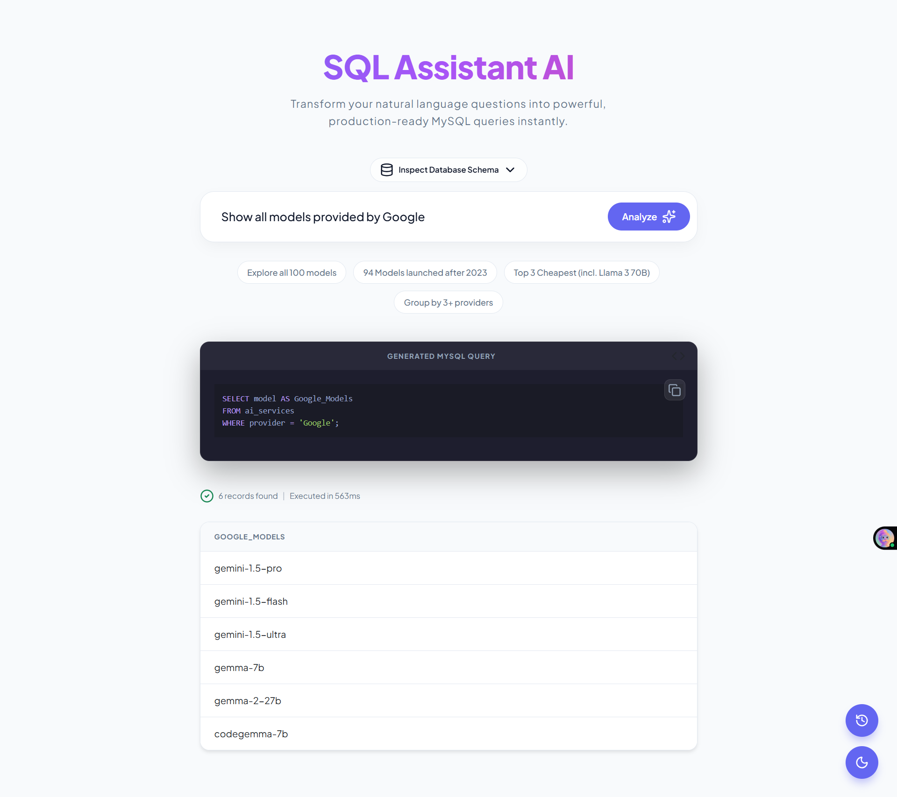
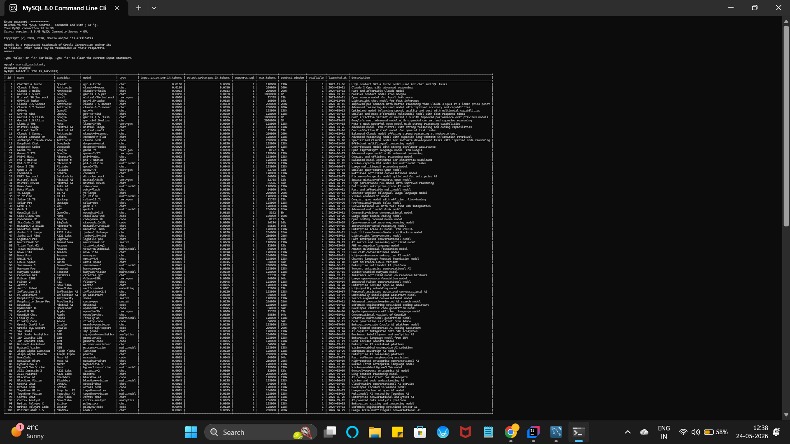
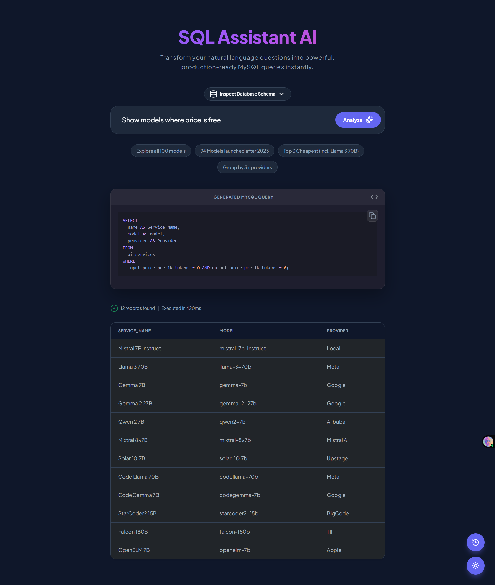
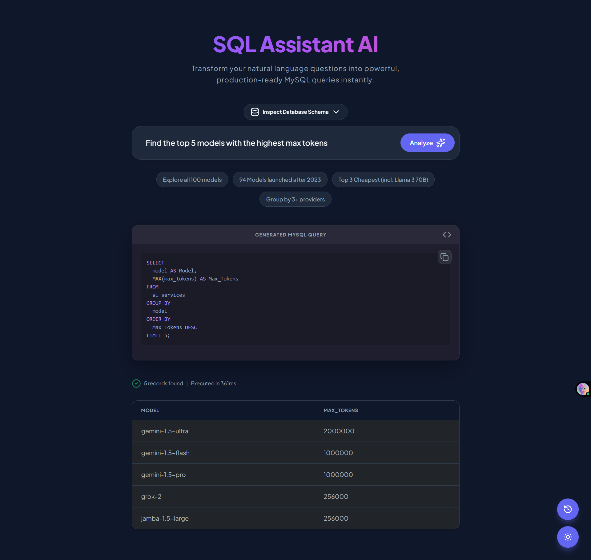
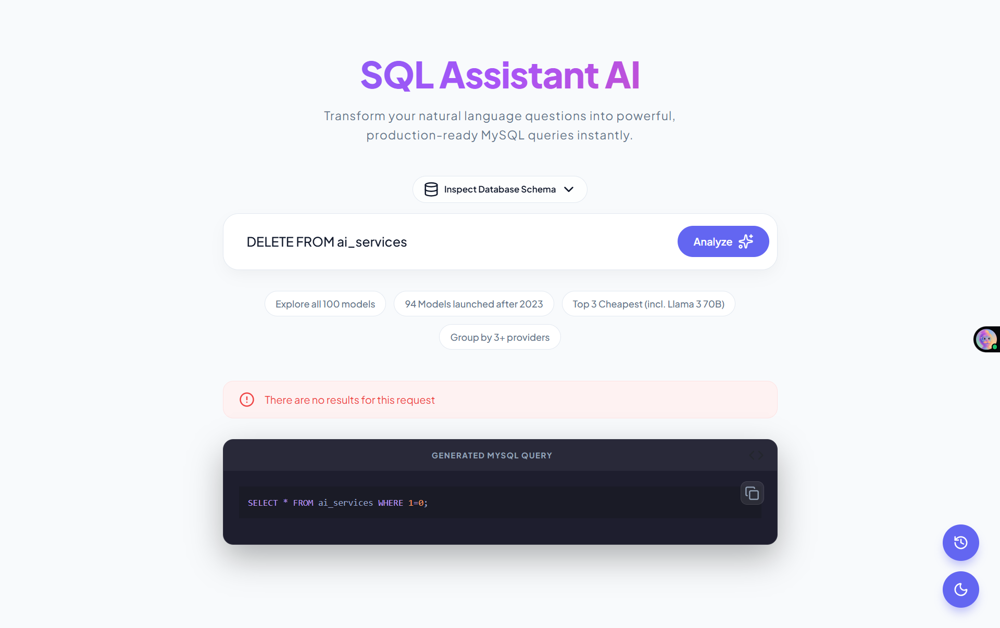
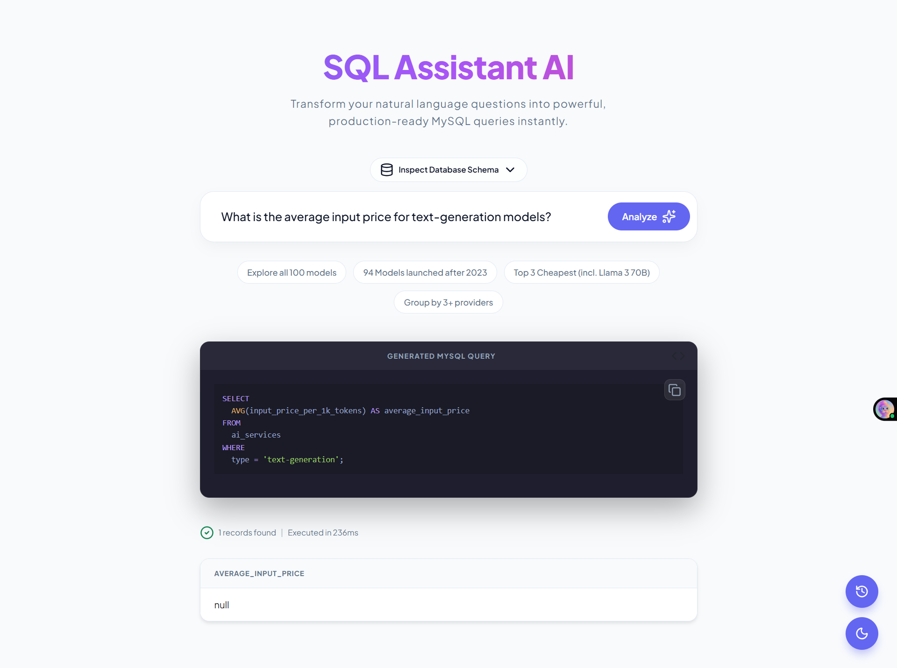

# 🤖 SpringAI SQL Assistant

[](https://www.oracle.com/java/technologies/javase/jdk21-archive-downloads.html)
[](https://spring.io/projects/spring-boot)
[](https://spring.io/projects/spring-ai)
[](LICENSE)

**SpringAI SQL Assistant** is a powerful, modern web application that transforms natural language questions into production-ready MySQL queries using the latest LLM models. Built with Spring Boot and Spring AI, it leverages the **Groq API** (Llama 3.3 70B) for lightning-fast inference and accurate SQL generation.

---

## 📸 Overview

### Modern UI Dashboard


### Video Demo
[Watch the App in Action](media_examples/app_video.mp4)

### Database Insights


### Visual Query Examples

#### ✅ Successful Queries
| Natural Language Request | AI Generated Result |
|:---:|:---:|
|  |  |

#### ❌ Error Handling
| Empty/Invalid Question | SQL Execution Error |
|:---:|:---:|
|  |  |

---

## ✨ Key Features

- 🗣️ **Text-to-SQL Conversion**: Simply ask questions in plain English (e.g., *"Find all models launched after 2023"*) and get optimized MySQL queries.
- 📊 **Interactive Dashboard**: Real-time statistics about your database content (total models, recent additions, top providers).
- ⚡ **Powered by Groq**: High-speed inference using Llama 3.3 70B through Spring AI's OpenAI-compatible integration.
- 🌓 **Dark Mode Support**: A sleek, modern UI with a responsive design that adapts to your preferences.
- 🔍 **Schema Inspection**: Built-in tool to view your database structure and available columns.
- 🐳 **Docker Ready**: Easy deployment with Docker and Docker Compose.

---

## 🏗️ Architecture

The application follows a clean service-oriented architecture:
1. **Frontend**: Thymeleaf templates with Bootstrap 5 and Lucide icons.
2. **Controller**: Handles user input and coordinates between AI and Database services.
3. **TextToSqlService**: Communicates with Groq LLM to generate SQL from natural language.
4. **SqlExecutorService**: Validates and executes the generated SQL against the MySQL database.
5. **DashboardService**: Provides real-time metrics for the landing page.

---

## 🛠️ Technology Stack

- **Backend**: Java 21, Spring Boot 3.4.5
- **AI Framework**: Spring AI (OpenAI Starter)
- **Model**: Llama-3.3-70b-versatile (via Groq)
- **Database**: MySQL 8.0
- **Frontend**: Thymeleaf, Bootstrap 5, Lucide Icons, Highlight.js
- **Containerization**: Docker, Docker Compose

---

## 🚀 Getting Started

### Prerequisites
- **Java 21** or higher
- **Groq API Key**: Get it from [Groq Console](https://console.groq.com/keys)
- **Docker & Docker Compose** (optional, for containerized setup)

### Option 1: Using Docker (Recommended)

1. **Clone the repository**:
   ```bash
   git clone https://github.com/sundaram22verma/SpringAI-SQL-Assistant.git
   cd SpringAI-SQL-Assistant
   ```

2. **Set Environment Variables**:
   Create a `.env` file in the root directory:
   ```bash
   GROQ_API_KEY=your_groq_api_key_here
   ```

3. **Launch with Docker Compose**:
   ```bash
   docker-compose up -d
   ```
   *This will start both the MySQL database (automatically initialized with `spring_ai_init.sql`) and the Spring Boot application.*

4. **Access the App**:
   Open [http://localhost:8080](http://localhost:8080) in your browser.

---

### Option 2: Manual Setup

1. **Database Setup**:
   - Create a MySQL database named `SQL_Assistant`.
   - Execute the scripts in `spring_ai_init.sql` to initialize the schema and seed data.

2. **Environment Configuration**:
   Set your Groq API key as an environment variable:
   ```bash
   export GROQ_API_KEY=your_groq_api_key
   ```
   Or update `src/main/resources/application.properties` directly (not recommended for secrets).

3. **Build and Run**:
   ```bash
   ./mvnw clean package
   java -jar target/SpringAI-0.0.1-SNAPSHOT.jar
   ```

---

## 📁 Project Structure

```text
src/main/java/madhav/SpringAI/
├── config/             # ChatClient and AI configurations
├── controller/         # Web endpoints (AskController)
├── exception/          # Custom error handling
├── model/              # DTOs and Data models
├── service/            # Business logic interfaces
└── service/impl/       # Implementations (AI, SQL, Dashboard)
```

---

## 🤝 Contributing

Contributions are welcome! Please feel free to submit a Pull Request.

1. Fork the Project
2. Create your Feature Branch (`git checkout -b feature/AmazingFeature`)
3. Commit your Changes (`git commit -m 'Add some AmazingFeature'`)
4. Push to the Branch (`git push origin feature/AmazingFeature`)
5. Open a Pull Request

---

## 📜 License

Distributed under the MIT License. See `LICENSE` for more information.

---

## 📬 Contact & Support

If you find this project useful, I'd love to hear from you!

- **LinkedIn**: [Sundaram Verma](https://www.linkedin.com/in/sundaram22verma/) 🔗
- **Show your support**: If you use this project in your own work, please consider giving it a **Star** ⭐ and a shoutout on LinkedIn! I'd love to see what you build.
- **Project Link**: [GitHub Repository](https://github.com/sundaram22verma/SpringAI-SQL-Assistant)
