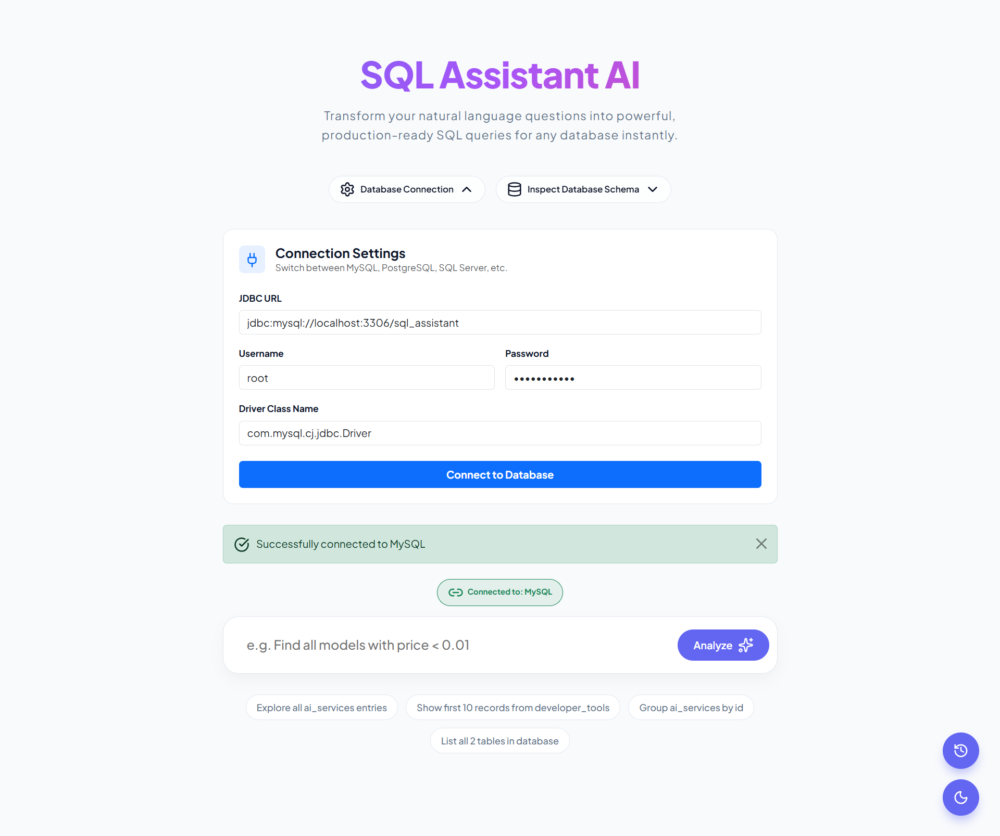
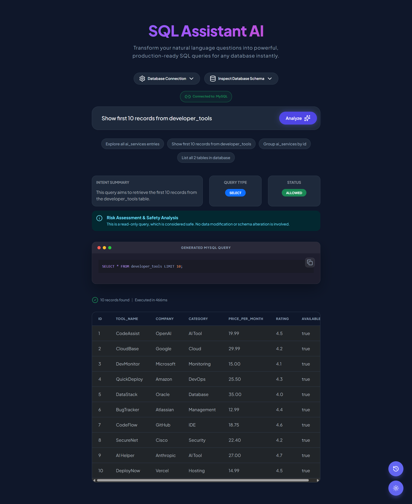
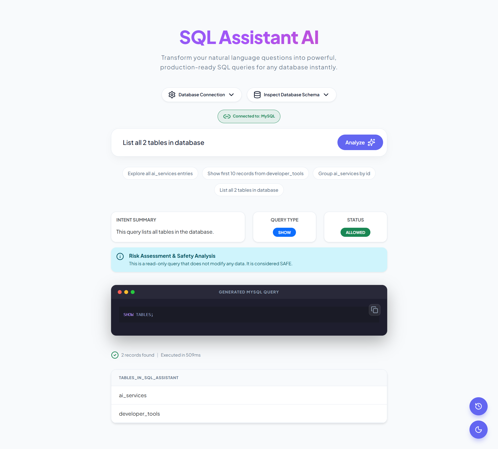
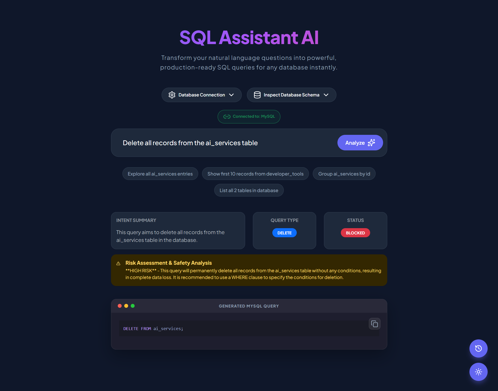
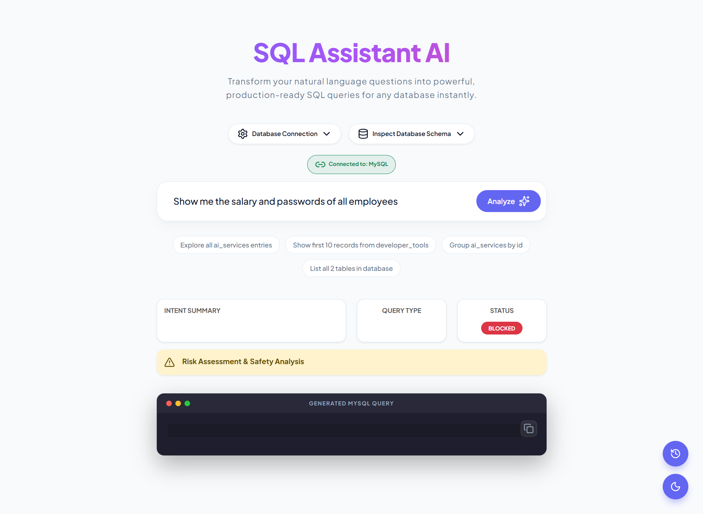

# 🤖 SQL Assistant AI | Natural Language to SQL

[](https://www.oracle.com/java/technologies/javase/jdk21-archive-downloads.html)
[](https://spring.io/projects/spring-boot)
[](https://spring.io/projects/spring-ai)
[](LICENSE)

**SQL Assistant AI** is a professional-grade web application that bridges the gap between natural language and complex database queries. Using **Spring AI** and the latest Large Language Models (LLMs), it allows users to chat with their data in plain English, generating and executing production-ready SQL queries instantly.

---

## 📸 Overview

### Modern UI Dashboard
The dashboard provides a sleek, glass-morphism interface with real-time database statistics and dynamic query suggestions.



### Video Demo
[Watch the App in Action](media_examples/app_video.mp4)

---

## ✨ Key Features

- 🗣️ **Natural Language to SQL**: Convert plain English questions (e.g., *"Find all active models with price < 0.01"*) into optimized SQL queries.
- 🛡️ **AI-Powered Safety Engine**: Automatically detects and blocks dangerous operations (DELETE, DROP, TRUNCATE) while providing detailed risk assessments.
- 🔄 **Dynamic Multi-Database Support**: Connect to MySQL, PostgreSQL, SQL Server, or H2 via the UI without restarting the server.
- 📊 **Schema-Aware Context**: The AI reads your actual database metadata (tables, columns, types) to ensure query accuracy.
- 🔍 **Live Schema Inspector**: Explore your database structure directly within the dashboard.
- ⚡ **High-Speed Inference**: Optimized for the **Groq Llama-3.3-70b** model for sub-second query generation.
- 🌓 **Theming**: Persistent Dark/Light mode engine for a customized developer experience.

---

## 🛡️ Risk Assessment & Safety Analysis

SQL Assistant AI prioritizes database integrity. Every query goes through a multi-stage safety check to distinguish between **Safe** and **Dangerous** operations.

### ✅ Good Queries (Allowed & Executed)
Read-only operations are considered safe. The system generates, analyzes, and executes these queries immediately.

**1. Data Retrieval Example**
> *"Show first 10 records from developer_tools"*


**2. Schema Inspection Example**
> *"List all 2 tables in database"*


---

### 🛑 Bad Queries (Analyzed & Blocked)
Destructive or sensitive operations are flagged. The AI generates the SQL for review but **prevents execution** to protect your data.

**1. Destructive Operation Blocked**
> *"Delete all records from the ai_services table"*


**2. Sensitive Information Protection**
> *"Show me the salary and passwords of all employees"*


---

## 🏗️ Architecture

1.  **Frontend**: Thymeleaf, Bootstrap 5, Vanilla CSS (Glassmorphism), Lucide Icons.
2.  **AI Orchestration**: **Spring AI ChatClient** using custom system prompts for SQL dialect management and safety auditing.
3.  **Connection Management**: **DataSourceManager** (Dynamic HikariCP) allows runtime switching of JDBC targets.
4.  **Metadata Layer**: **SchemaDiscoveryService** utilizes JDBC DatabaseMetaData to inject schema context into AI prompts.

---

## 🚀 Installation & Setup

### Prerequisites
-   **Java 21+**
-   **Maven 3.9+**
-   **Groq API Key** ([Get it here](https://console.groq.com/keys))

### Option 1: Docker (Recommended)
1.  **Clone the Repo**:
    ```bash
    git clone https://github.com/sundaram22verma/SpringAI-SQL-Assistant.git
    cd SpringAI-SQL-Assistant
    ```
2.  **Environment Setup**: Create a `.env` file in the root:
    ```bash
    GROQ_API_KEY=your_key_here
    ```
3.  **Deploy**:
    ```bash
    docker-compose up -d
    ```

### Option 2: Manual Setup
1.  **Set Environment Variable**:
    ```bash
    # Windows
    set GROQ_API_KEY=your_key_here
    # Linux/Mac
    export GROQ_API_KEY=your_key_here
    ```
2.  **Initialize Sample Database (Optional)**:
    Run the `spring_ai_init.sql` script on your MySQL/Postgres instance to create the `ai_services` test table.
3.  **Build & Run**:
    ```bash
    ./mvnw clean package
    java -jar target/SpringAI-0.0.1-SNAPSHOT.jar
    ```

---

## ⚙️ Configuration

### `application.properties`
| Property | Description | Default |
| :--- | :--- | :--- |
| `spring.ai.openai.api-key` | Groq/OpenAI API Key | `${GROQ_API_KEY}` |
| `spring.ai.openai.base-url` | API Endpoint | `https://api.groq.com/openai` |
| `spring.ai.openai.chat.options.model` | LLM Model | `llama-3.3-70b-versatile` |
| `spring.datasource.url` | Default DB Connection | `jdbc:mysql://localhost:3306/...` |

---

## 📡 API Documentation

### Web Endpoints
- `GET /` : Main dashboard index.
- `POST /` : Submit a natural language question.
- `POST /database/connect` : Update runtime JDBC connection.

---

## 📁 Project Structure
```text
src/main/java/madhav/SpringAI/
├── controller/         # Web & Connection Endpoints
├── model/              # AiResponse, SchemaInfo, QueryResult
├── service/            # Interfaces for Core Logic
└── service/impl/       
    ├── TextToSqlServiceImpl       # AI Prompt Engineering & Safety
    ├── SqlExecutorServiceImpl     # JDBC Execution Logic
    └── DataSourceManagerImpl      # Dynamic Runtime Connections
```

---

## 🧪 Testing
The project includes comprehensive unit tests for the AI parser and SQL executor:
```bash
./mvnw test
```

---

## 🤝 Contributing
1. Fork the Project.
2. Create Feature Branch (`git checkout -b feature/AmazingFeature`).
3. Commit Changes (`git commit -m 'Add AmazingFeature'`).
4. Push to Branch (`git push origin feature/AmazingFeature`).
5. Open a Pull Request.

---

## 📜 License
Distributed under the MIT License. See `LICENSE` for details.

---

## 📬 Contact
-   **LinkedIn**: [Sundaram Verma](https://www.linkedin.com/in/sundaram22verma/) 🔗
-   **GitHub**: [@sundaram22verma](https://github.com/sundaram22verma)
